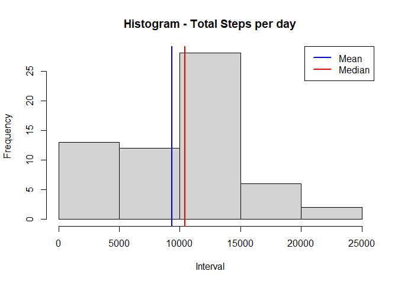
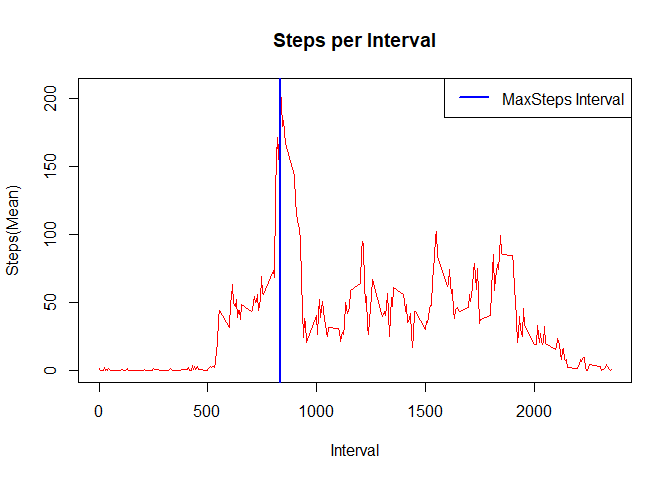
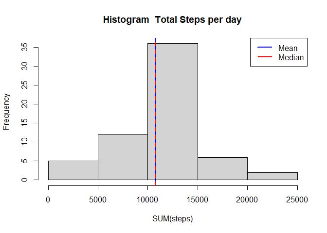
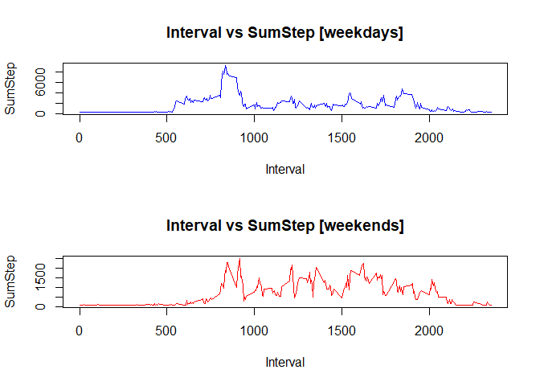

Reproducible Research: Assignment 1
===================================

------------------------------------------------------------------------

1.Code for reading in the dataset and/or processing the data
------------------------------------------------------------

Load the data.

    d<- read.csv (file = "activity.csv", header = TRUE)
    d$date<-as.Date(d$date,format='%Y-%m-%d')

2 Histogram of the total number of steps taken each day
-------------------------------------------------------

    q2 <- aggregate(x = d[c("steps","interval")],
                         FUN = sum,
                         by = list(Group.date = d$date), na.rm=TRUE)

    ##  Histogram
    hist(q2$steps,
         col = "lightgray",
         border = "black", 
         xlab = "Interval",
         main = "Histogram - Total Steps per day")
      abline(v = mean(q2$steps),
             col = "blue",
             lwd = 2)
      abline(v = median(q2$steps),
             col = "red",
             lwd = 2)
      legend(x = "topright", 
           c("Mean", "Median"),
           col = c("blue", "red"),
           lwd = c(2, 2, 2))

3. Mean and median number of steps taken each day
-------------------------------------------------

    q3_mean <- setNames(aggregate(x = d[c("steps")],
                    FUN = mean,
                    by = list(d$date), na.rm=TRUE), c("Date", "Mean"))

    q3_median <- setNames(aggregate(x = d[c("steps")],
                        FUN = median,
                        by = list(d$date), na.rm=TRUE), c("Date", "Median"))

    q3 <- merge(q3_mean,q3_median,by="Date")

    print(q3)

         Date       Mean Median

1 2012-10-01 NaN NA 2 2012-10-02 0.4375000 0 3 2012-10-03 39.4166667 0 4
2012-10-04 42.0694444 0 5 2012-10-05 46.1597222 0 6 2012-10-06
53.5416667 0 7 2012-10-07 38.2465278 0 8 2012-10-08 NaN NA 9 2012-10-09
44.4826389 0 10 2012-10-10 34.3750000 0 11 2012-10-11 35.7777778 0 12
2012-10-12 60.3541667 0 13 2012-10-13 43.1458333 0 14 2012-10-14
52.4236111 0 15 2012-10-15 35.2048611 0 16 2012-10-16 52.3750000 0 17
2012-10-17 46.7083333 0 18 2012-10-18 34.9166667 0 19 2012-10-19
41.0729167 0 20 2012-10-20 36.0937500 0 21 2012-10-21 30.6284722 0 22
2012-10-22 46.7361111 0 23 2012-10-23 30.9652778 0 24 2012-10-24
29.0104167 0 25 2012-10-25 8.6527778 0 26 2012-10-26 23.5347222 0 27
2012-10-27 35.1354167 0 28 2012-10-28 39.7847222 0 29 2012-10-29
17.4236111 0 30 2012-10-30 34.0937500 0 31 2012-10-31 53.5208333 0 32
2012-11-01 NaN NA 33 2012-11-02 36.8055556 0 34 2012-11-03 36.7048611 0
35 2012-11-04 NaN NA 36 2012-11-05 36.2465278 0 37 2012-11-06 28.9375000
0 38 2012-11-07 44.7326389 0 39 2012-11-08 11.1770833 0 40 2012-11-09
NaN NA 41 2012-11-10 NaN NA 42 2012-11-11 43.7777778 0 43 2012-11-12
37.3784722 0 44 2012-11-13 25.4722222 0 45 2012-11-14 NaN NA 46
2012-11-15 0.1423611 0 47 2012-11-16 18.8923611 0 48 2012-11-17
49.7881944 0 49 2012-11-18 52.4652778 0 50 2012-11-19 30.6979167 0 51
2012-11-20 15.5277778 0 52 2012-11-21 44.3993056 0 53 2012-11-22
70.9270833 0 54 2012-11-23 73.5902778 0 55 2012-11-24 50.2708333 0 56
2012-11-25 41.0902778 0 57 2012-11-26 38.7569444 0 58 2012-11-27
47.3819444 0 59 2012-11-28 35.3576389 0 60 2012-11-29 24.4687500 0 61
2012-11-30 NaN NA \#\# 4. Time series plot of the average number of
steps taken

    q4_mean <- setNames(aggregate(x = d[c("steps")],
                                 FUN = mean,
                                 by = list(d$interval), na.rm=TRUE), c("Interval", "MeanStep"))

    ## Interval with Max Average Steps
    q4_max<-subset(q4_mean, q4_mean$MeanStep==max(q4_mean$MeanStep, na.rm = TRUE))

    ## plot histogram
    plot(q4_mean$Interval, q4_mean$MeanStep, type="l", main = "Steps per Interval", xlab= "Interval", ylab= "Steps(Mean)", col="red" ,lwd=1)
        abline(v = q4_max$Interval, col = "blue", lwd = 2)
        legend(x = "topright", 
               c("MaxSteps Interval"),
               col = c("blue"),
               lwd = c(2, 2, 2))

\#\# 5. The 5-minute interval that, on average, contains the maximum
number of steps

    q4_max<-subset(q4_mean, q4_mean$MeanStep==max(q4_mean$MeanStep, na.rm = TRUE))
        print(q4_max)

    Interval MeanStep

104 835 206.1698

6. Code to describe and show a strategy for imputing missing data
-----------------------------------------------------------------

    ## original data to be stored in a new variable called 'q6'
    q6 <- d

    ##NA values in column 'Steps' are replaced with global average
    q6$steps[which(is.na(q6$steps))] <- mean(q6$steps, na.rm = TRUE)

    ## example
    head(q6)

    steps       date interval

1 37.3826 2012-10-01 0 2 37.3826 2012-10-01 5 3 37.3826 2012-10-01 10 4
37.3826 2012-10-01 15 5 37.3826 2012-10-01 20 6 37.3826 2012-10-01 25
\#\# 7. Histogram of the total number of steps taken each day after
missing values are imputed

    q7 <- aggregate(x = q6[c("steps")],
                    FUN = sum,
                    by = list(Group.date = d$date), na.rm=TRUE)

    ## stats
    q7_mean <- setNames(aggregate(x = q7[c("steps")],
                                 FUN = mean,
                                 by = list( q7$Group.date), na.rm=TRUE), c("Date", "Mean"))

    q7_median <- setNames(aggregate(x = q7[c("steps")],
                                   FUN = median,
                                   by = list(q7$Group.date), na.rm=TRUE), c("Date", "Median"))

    q7_all <- merge(q7_mean,q7_median,by="Date")

    hist(q7$steps,
           col = "lightgray",
           border = "black", 
           xlab = "SUM(steps)",
           main = "Histogram  Total Steps per day")
            abline(v = mean(q7$steps),
             col = "blue",
             lwd = 2)
            
            abline(v = median(q7$steps),
             col = "red",
             lty = 2,
             lwd = 2)
            
            legend(x = "topright", 
             c("Mean","Median"),
             col = c("blue","red"),
             lwd = c(2, 2, 2))

\#\# 8. Panel plot comparing the average number of steps taken per
5-minute interval across weekdays and weekends

    q8<-q6
    q8$day <- weekdays(q6$date)
    q8$day <- ifelse(q8$day == "Saturday" | q8$day == "Sunday" ,"weekend", "weekday")
    q8$day <- as.factor(q8$day)

    ## aggregated data for graphic
    q8_sum <- setNames(aggregate(x = q8[c("steps")],
                                 FUN = sum,
                                 by = list(q8$interval, q8$day), na.rm=TRUE), c("Interval", "day", "SumStep"))

    ## subsetting data for graphics
    q8_weekday<-subset(q8_sum, q8_sum$day=="weekday")
    q8_weekend<-subset(q8_sum, q8_sum$day=="weekend")

    ## plot
      par(mfrow=c(2,1))
            plot(q8_weekday$Interval,q8_weekday$SumStep, main="Interval vs SumStep [weekdays]", type = "l", col = "blue", xlab = "Interval", ylab = "SumStep")
            plot(q8_weekend$Interval,q8_weekend$SumStep, main="Interval vs SumStep [weekends]", type = "l", col = "red", xlab = "Interval", ylab = "SumStep")

\#\# 9. All of the R code needed to reproduce the results (numbers,
plots, etc.) in the report
